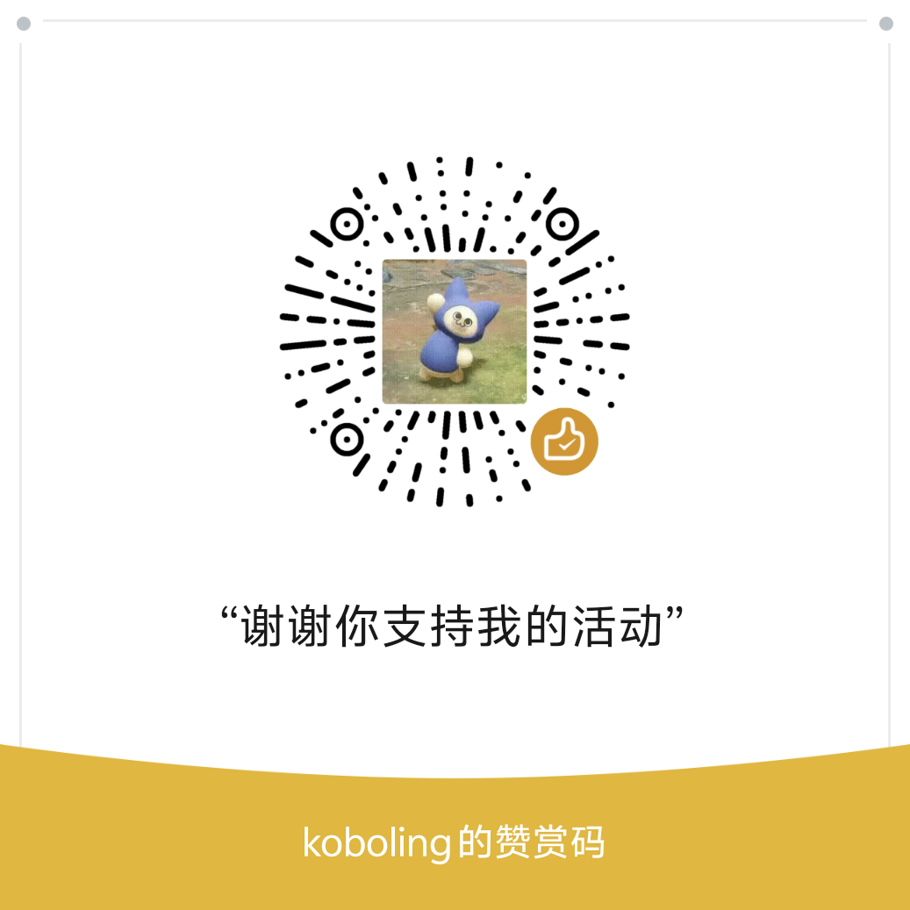

<div align="center">

# 🔒 NTK

### Need To Know

**Know less. Do more.**

*当所有多Agent框架都在让AI看更多信息时，*
*我们问了一个不同的问题：如果让AI看更少呢？*

[](https://github.com/kobolingfeng/ntk/actions/workflows/ci.yml)
[]()
[](LICENSE)
[]()
[](https://linux.do)

**[English](README_EN.md)** | 中文

</div>

---

## 这是什么

每一个多Agent框架都在做同一件事：给每个Agent尽可能多的上下文。更长的对话历史、更大的记忆库、更复杂的工具链——期望AI从海量信息中找到答案。

**NTK 做相反的事。**

军事情报领域有一个原则叫 "Need-to-Know Basis"——即使你有最高安全权限，你也只会被告知完成任务所必须知道的最小信息集。NTK 把这个原则带进了多Agent系统：

> **每个Agent只收到它完成任务所需的最少信息，一个字都不多给。**

这不是限制，这是优势。认知科学告诉我们，**选择性注意力**才是实现专注的本质——不是看到更多，而是忽略更多。LLM 同理：短上下文比长上下文更精确、更遵循指令、更不容易幻觉。给得越少，做得越好。

### 核心技术

- **自适应复杂度路由 (Adaptive Complexity Routing)** — 通过正则快速路径 + 轻量 LLM 分类器自动评估任务复杂度，将复杂任务分配给多阶段管线，简单任务一步直出。不同复杂度的任务走不同的处理通道。
- **选择性遗忘 (Selective Forgetting)** — Agent 间不传递原始上下文，而是经过信息密度压缩后按需投递。每个 Agent 只看到经过裁剪的最小充分信息集。
- **零开销分级 (Zero-Overhead Classification)** — 在内部测试集中约 63% 的任务通过正则快速路径在微秒级完成分级，完全绕过 LLM 分类器，实现零额外 token 消耗。
- **渐进式管线深度 (Progressive Pipeline Depth)** — 四级深度自适应：direct → light → standard → full，像 TCP 慢启动一样，只在必要时才升级复杂度。
- **双模型成本分离 (Dual-Model Cost Isolation)** — 95%+ token 走廉价模型，仅 2-5% 高信息密度决策使用强模型，实现类似混合精度训练的成本结构。

## 为什么选 NTK

### 🎯 自适应，不过度

大多数"智能"框架对所有任务走同一个复杂管道。写一个斐波那契函数？也要经过规划→调研→执行→验证四步。

NTK 不这样做。它先用**零开销正则分类器**（在测试集中处理约 63% 的任务）判断复杂度，只在必要时才启动更深的管道：

| 你的任务 | NTK 怎么做 | 开销 |
|---------|-----------|------|
| "写个排序函数" | 一步直出 | **~400 tok, 4秒** |
| "设计 REST API" | 调研→执行 | ~2500 tok, 19秒 |
| "微服务架构设计" | 完整管线 | ~3000 tok, 20秒 |

写斐波那契和设计微服务架构**不该花一样的钱**。NTK 正是为此设计。

### 💰 在 9 类教科书任务上实测：vs 全强模型成本节省 90%+

NTK 的核心策略是**双模型成本分离**：绝大多数工作交给廉价模型，只有真正需要深度推理的规划步骤才用强模型。

实测数据（9 类任务，每配置 3 次运行取均值）：

| | 全强模型 | 全廉价模型 | NTK（廉价为主） |
|---|---|---|---|
| 平均 token | ~689 | ~662 | **~256** |
| 强模型 token 占比 | 100% | 0% | **< 5%** |
| 平均执行时间 | ~13.5s | ~7.1s | **~5.4s** |
| 代码质量 | — | — | **人工审查 0 bug** |

> ⚠️ NTK vs 全强模型的成本差异主要来自模型单价差（廉价模型约为强模型 1/10~1/20 价格）。vs 裸调廉价模型，NTK 的 token 节省约 7-80%（因任务复杂度而异）。

### 🧪 经过验证，不是 demo

NTK 经过了 50+ 次内部系统性实验（样本有限，持续扩展中），包括：

- **6 种配置 × 多复杂度任务** 的优化矩阵
- **手动代码审查** 的质量验证（逐行检查 bug 和需求完成度）
- **消融实验** 证明每个模块的必要性
- **对比发现**：复杂管道处理简单任务时反而引入 bug（过度分解问题）

#### 真实场景测试（v0.1.2）

6 类生产级任务，6/6 全部通过（gpt-5.4-mini 为主，单次运行）：

| 场景 | 类型 | 深度 | Token | 时间 | 强模型占比 |
|------|------|------|-------|------|-----------|
| 多文件跨 service 软删除 | multi-file | direct | 1,156 | 16.8s | 0% |
| CI 失败日志分析+修复 | comprehension | light | 2,775 | 30.9s | 0% |
| 模糊性能优化需求 | ambiguous | standard | 3,998 | 35.1s | 0% |
| 噪声生产日志根因诊断 | noisy-context | direct | 1,278 | 26.4s | 0% |
| RateLimiter 设计+实现+测试 | multi-part | full | 10,749 | 320.4s | 13.9% |
| Express 代码重构+安全审查 | refactor | light | 4,412 | 35.1s | 0% |

> 平均 4,061 tok/任务。5/6 任务全程廉价模型，仅最复杂的 full 深度任务使用了 13.9% 强模型 token。
> 使用 `npx tsx src/cli.ts test:real` 复现。

#### 教科书任务基准

同一个函数（mergeIntervals, 6 项需求），三种深度：

| 深度 | Token | 时间 | Bug | 需求完成 |
|------|-------|------|-----|---------|
| Direct (NTK推荐) | **654** | **4.2s** | **0** | 6/6 |
| Full (完整管线) | 13,216 | 63.5s | 1 | 6/6 |

Direct 用了 Full **1/20 的 token**，零 bug。Full 因为过度分解反而引入了 1 个 bug。**越简单的任务越不该用复杂管道**——这正是自适应路由存在的意义。

<details>
<summary><b>📊 v0.1.2 基准测试（点击展开）— 3 次运行取均值±标准差</b></summary>

9 类任务，每个配置跑 3 次，NTK vs 廉价模型直调 vs 强模型直调：

| 任务 | NTK (tok) | 廉价直调 (tok) | 强模型直调 (tok) | vs 廉价 | vs 强 |
|------|-----------|-------------|--------------|--------|-------|
| Fibonacci | 153±24 | 320±36 | 173±1 | **-52%** | **-12%** |
| 深拷贝 | 299±28 | 731±71 | 578±96 | **-59%** | **-48%** |
| 翻译 | 82±1 | 97±1 | 82±0 | **-15%** | 0% |
| React vs Vue | 314±4 | 779±26 | 1208±317 | **-60%** | **-74%** |
| REST API 设计 | 325±1 | 1646±116 | 2246±4 | **-80%** | **-86%** |
| 代码重构 | 149±19 | 189±9 | 146±4 | **-21%** | +2% |
| Bug 分析 | 337±49 | 361±45 | 414±65 | **-7%** | **-19%** |
| 快排复杂度 | 333±5 | 676±12 | 849±30 | **-51%** | **-61%** |
| 防抖函数 | 310±1 | 1163±361 | 500±82 | **-73%** | **-38%** |

> 测试条件：廉价模型 gpt-5.4-mini，强模型 gpt-5.4，每配置 3 次运行。
> NTK 在 9/9 任务上全部 vs 廉价直调节省 token（最高 -80%）。
> 原始数据：`benchmarks/results/`。使用 `npx tsx src/cli.ts benchmark` 复现。

</details>

> **NTK 用更少的 token + 全廉价模型 = vs 全强模型方案综合成本节省 90%+**（主要来自模型单价差异）。
> vs 裸调廉价模型，token 节省 7-80%。智能验证跳过使 light 深度 token 减少 76%，耗时减少 65%。

## 快速开始

```bash
git clone https://github.com/kobolingfeng/ntk.git
cd ntk && npm install
cp .env.example .env  # 填入你的 API Key
```

### 一条命令

```bash
npx tsx src/cli.ts run "用Python写一个LRU缓存"
```

### MCP 一键接入

NTK 原生支持 [MCP 协议](https://modelcontextprotocol.io)，可直接接入 VS Code Copilot、Claude Desktop、OpenClaw 等任何支持 MCP 的客户端。

**方式一：npm 全局安装（推荐）**

```bash
npm install -g ntk
```

```json
{
  "mcpServers": {
    "ntk": {
      "command": "ntk",
      "args": ["mcp"]
    }
  }
}
```

**方式二：从源码运行**

```bash
git clone https://github.com/kobolingfeng/ntk.git
cd ntk && npm install
```

```json
{
  "mcpServers": {
    "ntk": {
      "command": "npx",
      "args": ["tsx", "src/mcp/server.ts"],
      "cwd": "/path/to/ntk"
    }
  }
}
```

接入后获得 3 个工具：
- **ntk_run** — 自适应管线（自动选择最优深度）
- **ntk_run_fast** — 极速模式（直接执行，最低开销）
- **ntk_compress** — 信息密度压缩

### 各平台接入指南

<details>
<summary><b>VS Code Copilot (GitHub Copilot Chat)</b></summary>

在项目根目录创建 `.vscode/mcp.json`：

```json
{
  "servers": {
    "ntk": {
      "command": "npx",
      "args": ["tsx", "src/mcp/server.ts"],
      "cwd": "/path/to/ntk"
    }
  }
}
```

重启 VS Code 后，在 Copilot Chat 中即可使用 `ntk_run` 等工具。

</details>

<details>
<summary><b>Claude Desktop</b></summary>

编辑 `~/Library/Application Support/Claude/claude_desktop_config.json`（macOS）或 `%APPDATA%\Claude\claude_desktop_config.json`（Windows）：

```json
{
  "mcpServers": {
    "ntk": {
      "command": "ntk",
      "args": ["mcp"]
    }
  }
}
```

需要先 `npm install -g ntk`。

</details>

<details>
<summary><b>OpenClaw / 其他 MCP 客户端</b></summary>

在你的 MCP 配置中添加 ntk server。所有支持 MCP 协议的客户端都可以使用 stdio transport 接入：

```json
{
  "mcpServers": {
    "ntk": {
      "command": "ntk",
      "args": ["mcp"],
      "env": {
        "API_ENDPOINT_1_KEY": "sk-your-key",
        "API_ENDPOINT_1_URL": "https://your-api.com/v1"
      }
    }
  }
}
```

环境变量可以通过 `env` 字段传入，也可以在 ntk 项目目录下的 `.env` 文件中配置。

</details>

### 工具使用示例

接入 MCP 后，在任意 AI 客户端中可以这样使用：

```
// 自适应执行 —— 自动选择最优深度
ntk_run({ task: "用Python写一个支持TTL的LRU缓存" })

// 极速执行 —— 简单任务一步直出
ntk_run_fast({ task: "写一个合并区间的函数" })

// 强制指定深度
ntk_run({ task: "设计微服务架构", forceDepth: "full" })

// 信息压缩
ntk_compress({ text: "很长的文本...", level: "aggressive" })
```

### 🐾 OpenClaw Token 节省

NTK 可以帮助 OpenClaw 用户降低 token 消耗。通过 MCP 接入后，在部分任务上 token 用量可减少 20-50%（因任务类型而异）：

| 场景 | 直接调用 | **NTK** | 节省 | 深度 |
|------|---------|---------|------|------|
| 写防抖函数 | ~200 tok | **96 tok** | **52%** | direct |
| 翻译技术文档 | ~150 tok | **92 tok** | **39%** | direct |
| CSV 转 JSON | ~200 tok | **153 tok** | **24%** | direct |
| 修复 async bug | ~350 tok | **287 tok** | **18%** | direct |
| 解释正则表达式 | ~400 tok | **427 tok** | -7% | direct |
| 重构为函数式 | ~250 tok | **179 tok** | **28%** | direct |
| 比较 React vs Vue | 798 tok | **734 tok** | **8%** | direct |
| Debug 代码分析 | 390 tok | **386 tok** | **1%** | direct |
| REST API 设计 | 1575 tok | **1519 tok** | **4%** | light |

> 以上数据来自实测（gpt-5.4-mini，2026.3.31，单次运行）。NTK 全程使用廉价模型，vs 全强模型方案加权成本节省 90%+；vs 裸调同款廉价模型，token 节省因任务而异（-7% ~ 52%）。
> 9/9 任务均走 direct/light 深度，无需强模型参与。

**一行接入：**
```json
{
  "mcpServers": {
    "ntk": { "command": "ntk", "args": ["mcp"] }
  }
}
```

接入后在 OpenClaw 对话中直接使用 `ntk_run` 和 `ntk_run_fast`，自动选择最省 token 的执行路径。

### 其他运行方式

```bash
npx tsx src/cli.ts interactive                # 交互模式
npx tsx src/cli.ts serve --port 3210          # HTTP API 服务
npx tsx src/cli.ts mcp                        # MCP stdio 服务
```

## 配置

NTK 需要你自备 OpenAI 兼容的 API 端点。**不内置任何 API Key**，你需要提供自己的。

### 基本配置

复制示例文件并编辑：

```bash
cp .env.example .env
```

**最简配置**（单端点 + 单模型）：

```env
API_ENDPOINT_1_KEY=sk-your-api-key
API_ENDPOINT_1_URL=https://api.openai.com/v1
API_ENDPOINT_1_NAME=openai
MODEL=gpt-5.4-mini
```

设置 `MODEL` 会让所有 Agent 使用同一模型。如需更低成本可用 `gpt-5.4-nano`。

### 双模型策略（推荐）

NTK 的核心优势是**只让规划使用强模型，其余全部用廉价模型**：

```env
API_ENDPOINT_1_KEY=sk-your-api-key
API_ENDPOINT_1_URL=https://api.openai.com/v1
API_ENDPOINT_1_NAME=openai

PLANNER_MODEL=gpt-5.4          # 强模型 — 仅 full 深度规划使用
COMPRESSOR_MODEL=gpt-5.4-mini  # 廉价模型 — Scout/Executor/Verifier 全用这个
```

在测试集中约 63% 的任务走 Direct 路径，不触发 Planner，因此多数请求仅使用廉价模型。

<details>
<summary><b>多端点故障转移 + 兼容提供商列表</b></summary>

配置多个 API 端点，NTK 启动时并行探测，自动选最快的可用端点：

```env
API_ENDPOINT_1_KEY=sk-key-a
API_ENDPOINT_1_URL=https://api.openai.com/v1
API_ENDPOINT_1_NAME=openai

API_ENDPOINT_2_KEY=sk-key-b
API_ENDPOINT_2_URL=https://your-backup.com/v1
API_ENDPOINT_2_NAME=backup

PLANNER_MODEL=gpt-5.4
COMPRESSOR_MODEL=gpt-5.4-mini
```

如果当前端点挂了，自动切换到下一个。

**兼容的 API 提供商** — 任何 OpenAI 兼容接口都可以用：

| 提供商 | URL 示例 | 说明 |
|--------|----------|------|
| OpenAI | `https://api.openai.com/v1` | 官方 API |
| Azure OpenAI | `https://your-resource.openai.azure.com/v1` | 企业级 |
| Ollama (本地) | `http://localhost:11434/v1` | 免费，需本地运行模型 |
| LM Studio (本地) | `http://localhost:1234/v1` | 免费，GUI 管理模型 |
| DeepSeek | `https://api.deepseek.com/v1` | 国产高性价比 |
| 其他转发站 | `https://your-proxy.com/v1` | 任何 OpenAI 兼容代理 |

**MCP 客户端中的配置** — 通过 `env` 字段直接传配置，不需要 `.env` 文件：

```json
{
  "mcpServers": {
    "ntk": {
      "command": "ntk",
      "args": ["mcp"],
      "env": {
        "API_ENDPOINT_1_KEY": "sk-your-key",
        "API_ENDPOINT_1_URL": "https://api.openai.com/v1",
        "API_ENDPOINT_1_NAME": "openai",
        "PLANNER_MODEL": "gpt-5.4",
        "COMPRESSOR_MODEL": "gpt-5.4-mini"
      }
    }
  }
}
```

</details>

### 调试与可观测性

```env
DEBUG=true  # 开启详细日志，显示路由决策和 Agent 调用链
```

使用 `--verbose`（或 `-v`）标志查看完整的管线追踪信息，包括路由决策路径、压缩统计、token 分布和耗时：

```bash
npx tsx src/cli.ts run "你的任务" --verbose
```

追踪信息包含：
- **路由路径**：正则快速路径 vs LLM 分类器、推测执行命中/未命中
- **压缩统计**：预过滤移除字符数、LLM 压缩调用次数、Tee 存储/恢复次数
- **Token 分布**：按 Agent 和模型类型（廉价/强）的 token 使用明细
- **耗时**：端到端执行时间

编程使用时，`PipelineResult.trace` 字段提供结构化的 `PipelineTrace` 对象，可用于自定义监控和分析。

## 架构

```
用户请求
  ↓
🔀 自适应分类器 (正则快速路径 / LLM)
  │
  ├── direct  →  🔧 Executor → 结果       ← 63%的任务走这里
  ├── light   →  🔧 Executor → 结果
  ├── standard → 🔍 Scout → 🔧 Executor → 结果
  └── full    →  🧠 Planner(强模型) → 🔧 Executor×N → ✅ Verifier → 结果
```

5 类 Agent，按信息密度分工：
- **Planner** — 唯一使用强模型，处理高密度决策（仅 full 深度触发）
- **Scout / Summarizer** — 廉价模型，信息收集与压缩
- **Executor** — 廉价模型，核心任务执行
- **Verifier** — 廉价模型，结果校验

### 🧹 确定性预过滤（RTK 兼容层）

NTK 在 LLM 压缩之前，先用**零 token 成本**的确定性策略过滤结构化噪声。这一层与语义压缩和路由隔离深度集成，实现两阶段信息压缩。

7 种过滤策略 + 智能输出类型检测：

| 策略 | 作用 | 示例 |
|------|------|------|
| ANSI 码清除 | 去掉终端颜色代码 | `\x1b[32mOK\x1b[0m` → `OK` |
| 进度条移除 | 删除进度指示器 | `████░░ 50%` → *(removed)* |
| 空行折叠 | 多个空行合并为一个 | 5 空行 → 1 空行 |
| 尾部空白清理 | 去掉行末多余空格 | `hello   ` → `hello` |
| 重复行合并 | 相同行合并为计数 | 4 次重复 → `... (×4)` |
| 通过测试剥离 | 只保留失败测试 | 15 passed, 2 failed → 只显示 2 failed |
| JSON 紧凑化 | 多行 JSON 压缩为单行 | pretty-print → compact |

**输出类型自动检测**：pre-filter 会自动识别输入是 test/json/log/build 中的哪种，只应用相关策略。

```bash
# 查看累计节省统计
npx tsx src/cli.ts gain
```

### 🔄 Tee 机制（压缩回溯）

压缩是有损的。NTK 的 Tee 机制在压缩时保存原始文本副本，当验证失败时可恢复完整内容，避免关键信息丢失。

```
压缩阶段:  原文(500 tok) → teeStore → 压缩文(80 tok) 传递给下游 Agent
验证失败:  Verifier 报告缺少关键细节 → teeRetrieve → 恢复原文(500 tok) 重新执行
验证通过:  teeClear → 释放存储
```

这使得 NTK 可以大胆压缩而不怕丢信息——最坏情况下回退到完整内容，而不是带着残缺信息反复重试。

<details>
<summary><b>📊 NTK vs 传统方案 — 能力对比（点击展开）</b></summary>

| 能力 | 传统单LLM | 仅I/O过滤 | NTK |
|------|:-----------:|:---:|:---:|
| 确定性预过滤（零 token 成本） | ❌ | ✅ | ✅ |
| 语义压缩（LLM 理解内容） | ❌ | ❌ | ✅ |
| 信息路由隔离 | ❌ | ❌ | ✅ |
| 自适应管线深度 | ❌ | ❌ | ✅ |
| 双模型成本分离 | ❌ | ❌ | ✅ |
| 压缩回溯（Tee 机制） | ❌ | ❌ | ✅ |
| 多 Agent 协作 | ❌ | ❌ | ✅ |
| 响应缓存（零成本重复查询） | ❌ | ❌ | ✅ |
| 智能输出类型检测 | ❌ | ❌ | ✅ |
| 代码感知压缩 | ❌ | ❌ | ✅ |

**基准测试结果（11 个测试用例）**：

| 方案 | 总 Token | 加权成本 |
|------|----------|---------|
| 传统单 LLM | 13407 | 100% |
| 仅 I/O 过滤 | 11263 | — |
| **NTK** | **12339** | **~9%** |

> I/O 过滤压缩的是数据（删字符），NTK 压缩的是认知（控信息流）。

运行对比：`npx tsx src/cli.ts compare`

</details>

<details>
<summary><b>研究实验（基准测试工具链）</b></summary>

NTK 附带完整的基准测试工具链：

```bash
npx tsx src/cli.ts test       # 9任务回归测试
npx tsx src/cli.ts test:real  # 6类真实场景测试
npx tsx src/cli.ts benchmark  # 多次运行基准测试（3×，均值±标准差）
npx tsx src/cli.ts baseline   # NTK vs 直接LLM对比
npx tsx src/cli.ts compare    # RTK vs Traditional vs NTK 三方对比
npx tsx src/cli.ts gain       # 累计节省统计
npx tsx src/cli.ts ablation   # 消融实验（各模块贡献）
npx tsx src/cli.ts optimize   # 6配置优化矩阵
```

详细 Skill 文档见 [SKILL.md](SKILL.md)。

</details>

## 社区

感谢 [LINUX DO](https://linux.do) 社区提供的支持。

## 赞助

如果 NTK 对你有帮助，欢迎支持一下：

<div align="center">
<table>
<tr>
<td align="center"><b>微信赞赏</b></td>
<td align="center"><b>链动小铺</b></td>
<td align="center"><b>PayPal</b></td>
</tr>
<tr>
<td align="center"></td>
<td align="center"></td>
<td align="center"><a href="https://paypal.me/koboling">paypal.me/koboling</a></td>
</tr>
</table>
</div>

## License

[AGPL-3.0](LICENSE) — 你可以自由使用、修改和分发，但任何修改版本或基于本项目的网络服务都必须以相同协议开源。
